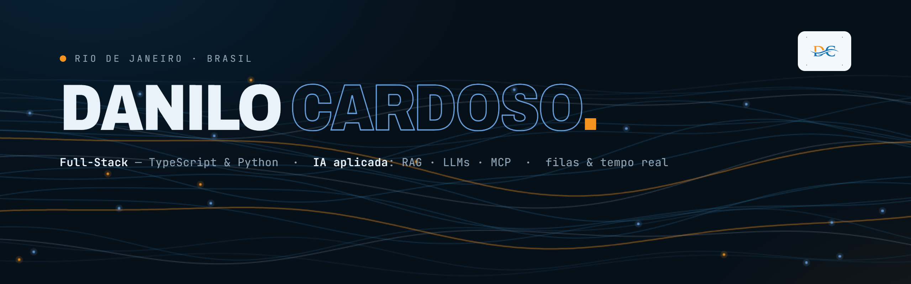

<!--cabeçalho HELLO WORD--> 
  
    <!--FIM cabeçalho HELLO WORD--> <!--inicio descrição-->
Olá, Me chamo Danilo Cardoso.
<ul align="left"> <li> 📍 Rio de Janeiro - RJ, Brasil </li>   <li>🚀 Mais de 4 anos de experiência construindo sistemas de ponta a ponta em TypeScript e Python — React e Next.js no front; NestJS, Fastify e FastAPI no back — e, atualmente, também desenvolvendo novos projetos com C# e Vue. Trabalho forte com IA aplicada em produção: RAG (pgvector, ChromaDB), LLMs (Claude, OpenAI, Ollama, Groq, Gemini), MCP (Model Context Protocol) implementado do zero e transcrição com Whisper. No dia a dia: filas e workers (BullMQ/Redis), tempo real (WebSocket/SSE), integrações com ERPs e gateways de pagamento, segurança (JWT com refresh rotation, 2FA TOTP, criptografia AES-256-GCM, RBAC, LGPD), Docker, Nginx, Terraform e AWS/Azure, sempre com metodologias ágeis (Scrum/Kanban), code review e clean code.🚀</li>    <li>👨‍💻 Atualmente sou Desenvolvedor Full-Stack na Álamo Benefícios, autor principal de um ecossistema de sistemas em produção para uma associação de proteção veicular: plataforma de WhatsApp multicanal (API oficial e não oficial), CRM SaaS de rede de consultores, intranet corporativa, autoadesão com pagamento online, gestão de sinistros, dashboards de BI, QA de call center por IA e automações que eliminam horas de trabalho manual todos os dias. Antes, passei pela BMS Consultoria Tributária (2023–2025), estagiei no BTG Pactual e fui Monitor de Ensino de JavaScript na Kenzie Academy Brasil.</li>   <li>🚧 Também estou construindo o Pági, meu SaaS (em desenvolvimento): o cliente conversa com uma IA pelo WhatsApp ou Telegram e sai com uma página de vendas publicada — funil, captura de leads, pixels de tráfego, SEO e checkout — mais um dashboard para acompanhar visitas, leads e conversão.</li>   <li>⚖️ Antes da tecnologia, foram 9 anos na área jurídica — de lá vieram o rigor com prazo, o cuidado com o detalhe e o hábito de entregar o que não pode falhar.</li>   <li>🎓 Cursando Engenharia da Computação no IBMR (conclusão prevista: 2027) e formado em Desenvolvimento Web Full-Stack pela Kenzie Academy Brasil. Meus principais conhecimentos são TypeScript, JavaScript, Python, C#, React, Next.js, Vue, Astro, NestJS, Fastify, FastAPI, Django, Flask, PostgreSQL, MySQL, MongoDB, Redis, IA aplicada (RAG, LLMs, MCP), Docker, Terraform, AWS e Azure.</li>   <li>🖥️ Aberto a boas conversas técnicas, parcerias e novos desafios — os projetos em que mais evoluí são privados (sistemas de empresa), mas conto com prazer numa conversa. Meu portfólio: <a href="https://portfolio-danilo-cardoso.vercel.app/">portfolio-danilo-cardoso.vercel.app</a> </li> </ul>   <!--FIM descrição--> 
  
 <!--INICIO Tecnologias-->   <h2 align="center">🛠️&ensp; <i>T E C N O L O G I A S</i> &ensp;🛠️</h2> 
  
   <!--Contatos--> <h3 align="center">📱 <i>C O N T A T O S</i> 📱</h2> 
     

